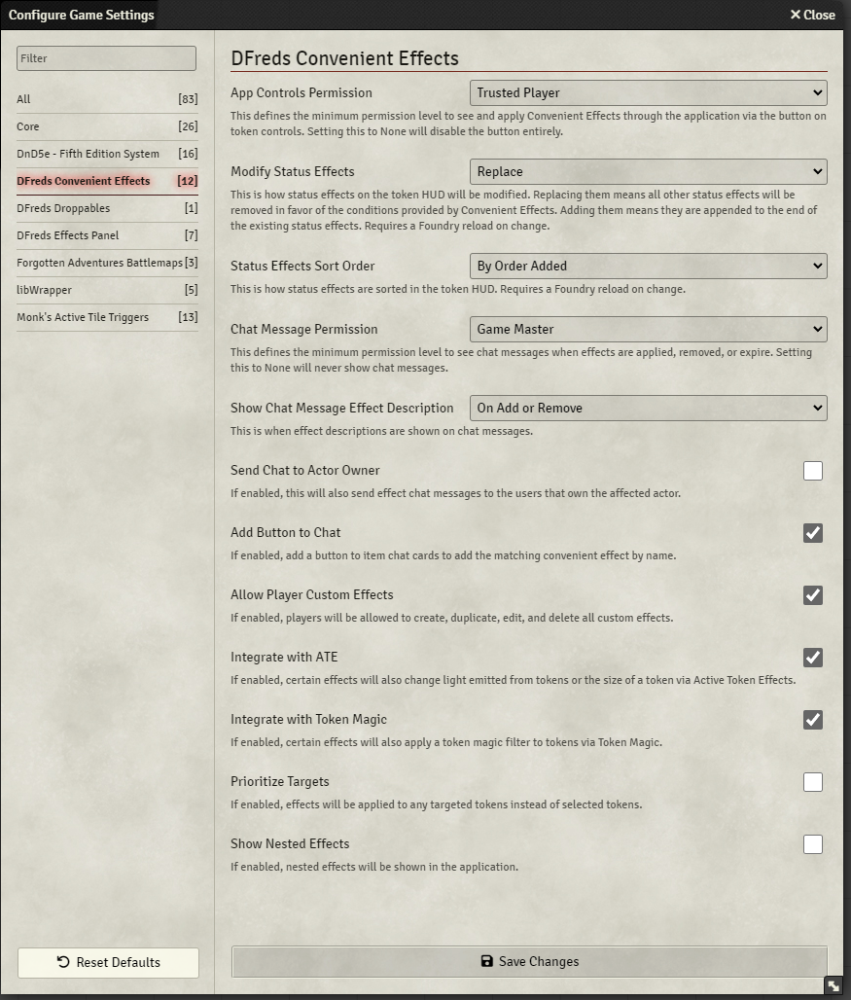

# DFreds Convenient Effects

__DFreds Convenient Effects__ is a FoundryVTT module that adds easy to use toggleable active effects for common use cases in the DND5e system.

## Let Me Sell You This

Do you struggle to remember what all those conditions and spells actually do to players and NPCs? Or how they interact? Consider this. Your player just rolled, but you forgot that they were invisible and should have rolled with advantage. But wait a minute, the enemy is also invisible! So now it cancels out. "Oh drats," you think to yourself to further prove this crazy point, "the player also has Bless cast on them! Has that expired yet??"

Sure, you could figure all that out... if you wanna be lame. Or you could be cool and just use this module.

## What This Module Does

This module  helps with the types of issues described above by providing dozens of pre-configured effects for conditions and spells that can all be applied quickly and easily.

You can configure some stuff:

## Modules That Help

While not strictly required, the functionalities provided by these modules drastically improve the usage of the various effects included in this module.

- [About Time](https://gitlab.com/tposney/about-time) and [Times Up](https://gitlab.com/tposney/times-up) by tposney - Handles spell effects expiring when their time is up or after a certain number of rounds or turns
- [DAE](https://gitlab.com/tposney/dae) by tposney - With midi-qol, handles various additional expiration effects such as after 1 attack or when an enemy is attacked
- [Midi-QOL](https://gitlab.com/tposney/midi-qol) by tposney - Handles a vast amount of automation relating to advantage and disadvantage

Noticing a trend? Thanks tposney!

## My Philosophy

I've noticed over the months that a lot of FoundryVTT modules lack focus and good coding practice. A user should never be in a situation where they forget what any given module does. Additionally, a power user should never be totally lost on what's going on in a module if they dive into it.

In case anyone out there in the void is curious, this is my philosophy when it comes to implementing modules.

- Code should be easy to read, self-documenting, and contain JSDocs for any public functions
- Modules should do one thing, and one thing only. No "Quality of Life" catchalls from me. NO SIREE BOB.
- That thing the module does should do it well, with a minimum amount of initial configuration. It should "[Just Work](https://upload.wikimedia.org/wikipedia/commons/b/bf/ToddHoward2010sm_%28cropped%29.jpg)".
- Additional configuration should only be added if it really makes sense. If the configuration starts to change the thing the module does well, it shouldn't be there.
- Readmes (like this) should be funny AND informative. Please create a pull request if you think it could be funnier or informativer.
